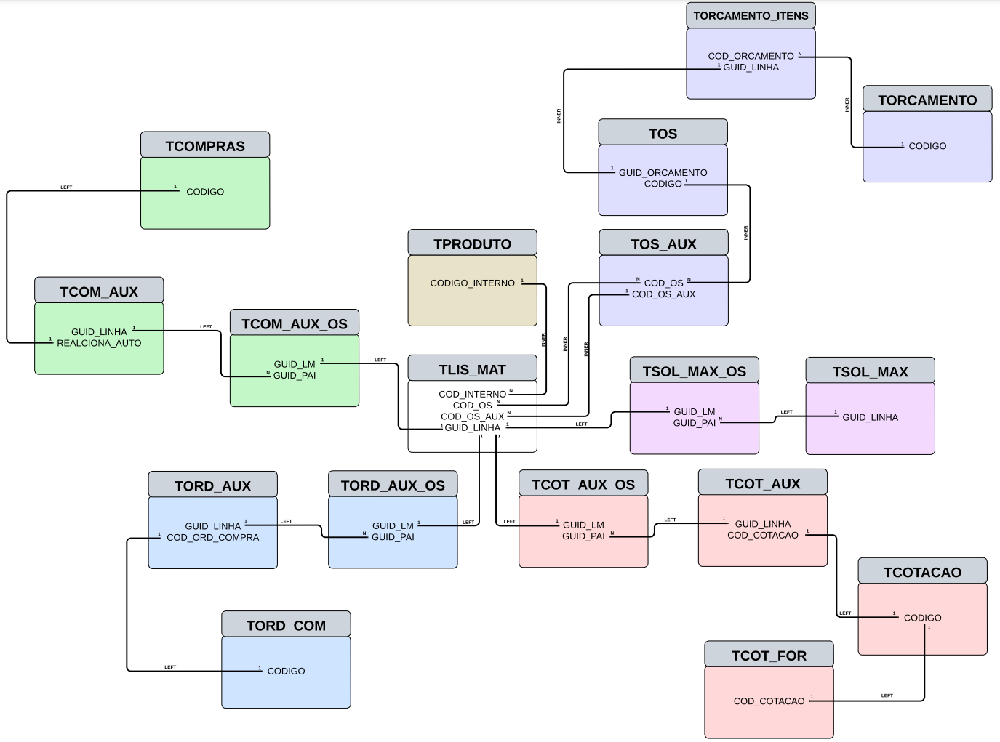
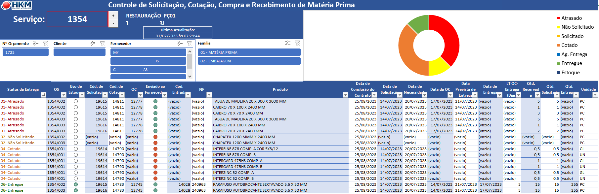

# Controle de Solicitação de Matéria-prima
Controle de rastreabilidade de matérias-primas utilizado em um banco de dados CPS do ERP GRV.  

## Problemática e Desafio:
Desenvolver uma solução capaz de unificar todo o rastreio de matéria prima, para que os gestores de contratos visualizem de forma prática e rápida toda a cadeia de suprimentos.

### vwMateriaPrima.sql:
View criada para unificar as informações da lista de materiais com diferentes tabelas do banco de dados CPS. O conceito de subqueries foi amplamente utilizado para minimizar o tempo de execução.

O arquivo com a consulta escrita está disponibilizado em **SQL/vwMateriaPrima.sql**

### Modelagem dos dados, Diagrama de Entidade Relacional:

Descrição visual dos relacionamentos entre as tabelas utilizadas. A tabela central, ou fato, é a lista de materiais solicitados nos projetos. 
As tabelas desenhadas no modelo star schema com relacionamento LEFT trazem informações das etapas do processo de compras e entrada de estoque, como data de solicitação, previsão de entrega e nota fiscal de entrada. 

Os relacionamentos superiores de característica INNER são responsáveis por levantar informações a respeito do projeto em que a matéria prima é solicitada, como código de serviço, nome do cliente e segmento do projeto.

O arquivo PDF com maior qualidade pode ser encontrado em **Documentação/DER_vwMateriaPrima.pdf**

### Arquivo Excel com conectividade à consulta *vwMateriaPrima*:
Arquivo final utilizado pelos funcionários, com uma macro de pesquisa de serviços para facilitar a busca das informações. A planilha também contém algumas segmentações de dados e um gráfico de rosca para resumirem os dados filtrados.

O arquivo não é disponibilizado por conter informações sem autorização de divulgação, porém, toda estrutura de Visual Basic pode ser visualizada através dos arquivos **VBA/Macros.bas** e **VBA/AtualizarFiltro.cls** com seus devidos comentários.
